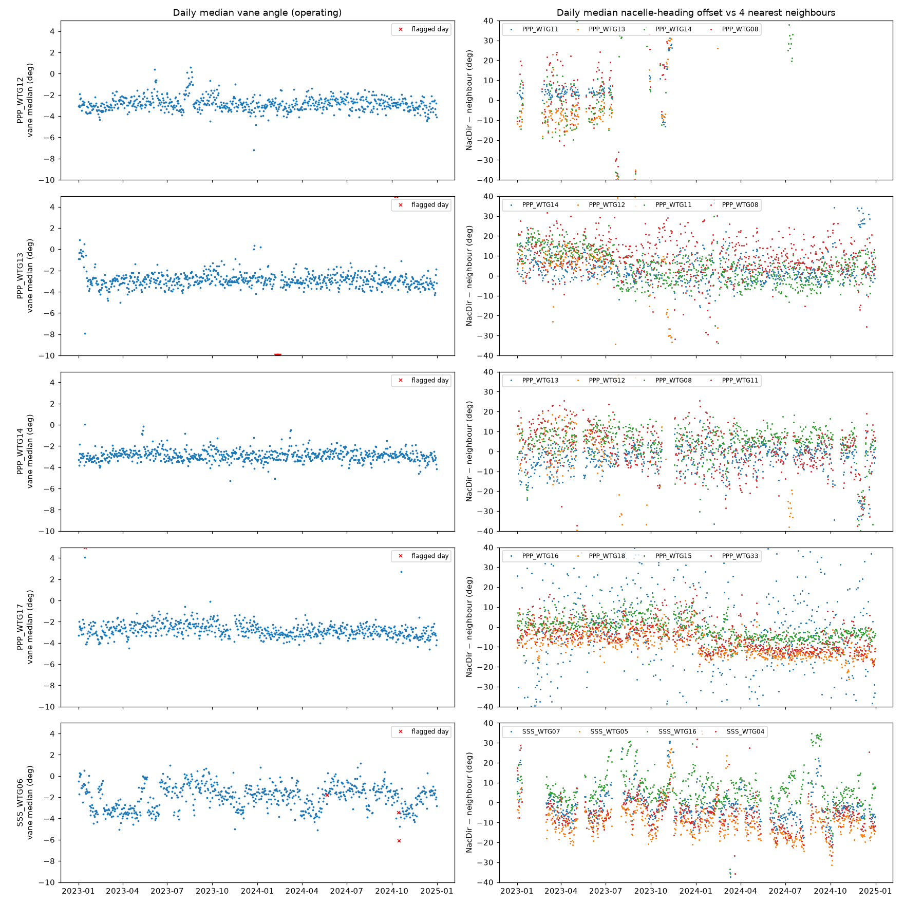
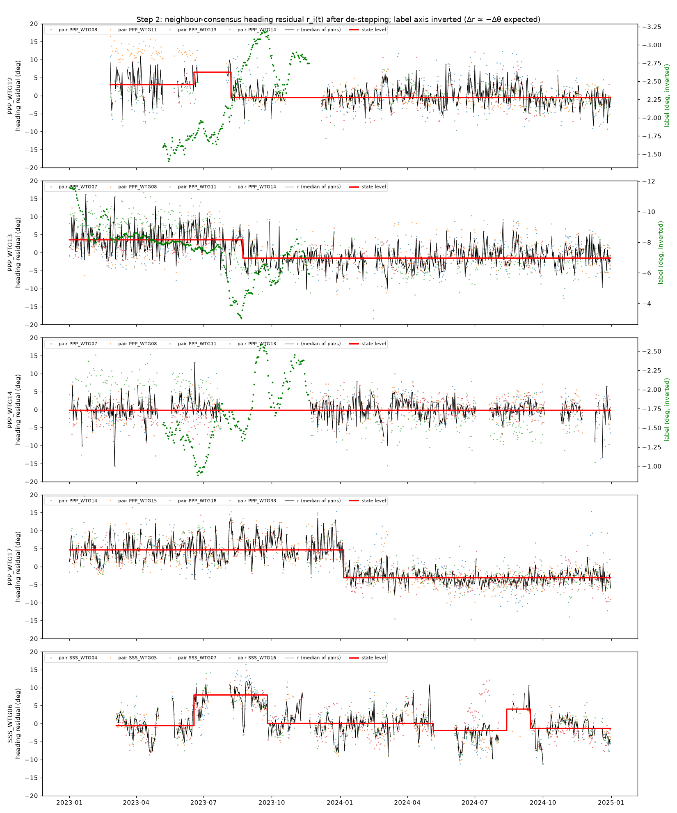
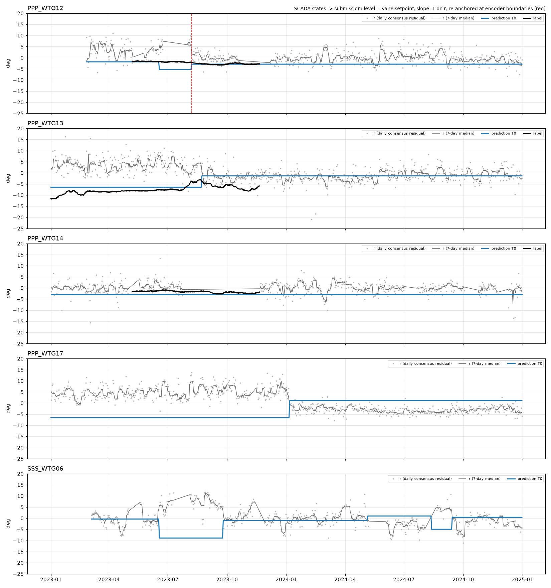

# Participant 33 — T0 method (label-free)

Method, code and theory behind `submissions/Results_33_T0_0.csv` (PPP_WTG17) and `submissions/Results_33_T0_final.csv`
(SSS_WTG06). Both files come from the same model with no fitted parameter:

$$
\hat\theta(d) \;=\; L \;-\; \big(\bar r_{\ell(d)} - \alpha_{\mathrm{seg}(\ell(d))}\big)
$$

| Symbol | Meaning | Source |
|----|----------------------|--------|
| $\hat\theta(d)$ | predicted static yaw misalignment on day $d$ | |
| $\ell(d)$ | the day's state; submitted as `cluster` | change points of $r$ (§3) |
| $\bar r_\ell$ | level of the neighbour heading residual in state $\ell$ | §2 |
| $\alpha_{\mathrm{seg}}$ | anchor: day-weighted mean of $\bar r_\ell$ over an encoder-free segment | §4 |
| $L$ | level prior: the turbine's vane set-point | §4 |

In words: the *changes* of the misalignment are read from how the nacelle
heading moves against its neighbours, with a slope of exactly −1 that follows
from the sensor algebra; the *level* is taken from the vane set-point.

## 1. Sensor model

Unobserved: true wind direction $W$, true nacelle heading $N$, yaw error
$\gamma = W - N$ (wrapped to ±180°). The SCADA stream reports

$$
N_r = N + \delta_n, \qquad v = g\,\gamma + \delta_v, \qquad W_r = N_r + v .
$$

- $\delta_n$: the nacelle encoder has no north reference. It is an arbitrary
  constant that jumps whenever the encoder is re-referenced.
- $v$: the vane reads the yaw error with a mounting offset $\delta_v$ and a gain
  $g \le 1$ (we use $g = 1$; it cannot be measured from this data).
- The third equation is how the data set is encoded, not an assumption: the vane
  is recovered as `vane = wrap(WindDir − NacDir)`, so `WindDir` carries the
  encoder offset and only the vane is encoder-free.

The yaw controller rotates the nacelle until the filtered vane sits at its
set-point $s$, so in steady state $E[v] = s$ and

$$
\theta \;\equiv\; E[\gamma] \;=\; \frac{s - \delta_v}{g} .
$$

$\theta$ is the static misalignment: the persistent yaw error the controller
cannot see, because it sits inside its own measurement.

**Consequence: the vane cannot see $\theta$.** Averaged over a day the vane
reads $s$ whatever $\theta$ is. The left column below shows it: the daily median
vane is flat at about −3° on every PPP turbine. Information about $\theta$ has
to come from an external direction reference, and the neighbours provide one
(right column: heading differences against the four nearest turbines, before any
cleaning).



## 2. The neighbour heading residual

Let $c = W + \kappa$ be a consensus of the wind direction from the neighbours,
with $\kappa$ a constant made of the neighbours' own offsets. Then

$$
N_r - c \;=\; N + \delta_n - W - \kappa \;=\; -\gamma + \delta_n - \kappa ,
$$

and averaged over a day

$$
r(d) = -\theta(d) + \delta_n(d) - \kappa
\qquad\Longrightarrow\qquad
\Delta r = -\Delta\theta \quad \text{whenever } \Delta\delta_n = 0 .
$$

So the residual gives **changes** of the misalignment in physical degrees, with
slope −1, independent of the vane and of any power model. Its **level** is not
identifiable, because $\delta_n$ and $\kappa$ are unknown constants.

How $r$ is built (10-minute aggregates, circular statistics throughout):

1. **Pair series.** For turbine $i$ and each of its 4 nearest same-site
   neighbours $j$: $D_{ij} = \mathrm{wrap}(N_r^i - N_r^j)$, in bins where both
   turbines operate.
2. **Encoder de-stepping.** A re-reference of $i$ moves $D_{ij}$ against *all*
   neighbours by the same amount on the same day. Jumps of at least 25° with
   the same sign in at least 60 % of the pairs within ±3 days are credited to the
   encoder and subtracted.
3. **Excursion masking.** Days more than 30° from the pair's 31-day rolling
   median are dropped.
4. **Sector correction.** Terrain and wakes make the heading difference depend
   on wind direction, so the median of $D_{ij}$ per 30° sector of the
   *neighbour's* wind direction is subtracted. This absorbs the neighbour's own
   offsets into $\kappa$.
5. **Robust daily value.** Median over the bins of the day per pair, then median
   over pairs: $r_i(d)$. Day-to-day noise is about 2°.



Coloured dots are the individual pairs, the black line is $r$, the red line the
state levels of §3. On the three training turbines the label is drawn in green
on an inverted axis, so $r$ and the label should move together.

## 3. States

$r$ is smoothed with a centred 7-day rolling median and segmented with PELT
(squared-error cost, penalty 400, minimum state length 14 days). The penalty
means a jump $J$ lasting $n$ days on both sides is accepted when
$nJ^2/2 \gtrsim 400$, e.g. 2.4° over 140 days or 5° over 30 days. Each state
gets the median of $r$ as its level $\bar r_\ell$.

A boundary with a jump above 15° is typed as an **encoder** boundary: too large
for a misalignment change, and step 2 only removes re-references of 25° or
more. $r$ is not comparable across such a boundary.

The states are computed from the SCADA residual over all 731 days, with no
knowledge of the template or of which days are scored. They are the `cluster`
column.

## 4. Level: vane set-point and anchor

No label-free estimator of the absolute level survived testing. Locating the
peak of the power-versus-yaw curve fails because over the controller's ±8°
deadband the power changes by only about 2 % ($\cos^2$ model), the same order
as sector, turbulence and season effects.

The level is therefore a prior. Assuming an unbiased vane ($\delta_v = 0$,
$g = 1$), $\theta = s$, and $s$ is measured as

$$
L = \mathrm{median}_{d\ \text{healthy}}\ \big(\text{daily median vane in operation}\big).
$$

The prior describes the turbine's *typical* state, so the state levels are
centred before the slope is applied. Within each encoder-free segment (a run of
states with no encoder boundary) the anchor $\alpha$ is the day-weighted mean of
the state levels. Re-anchoring per segment stops an undetected re-reference from
leaking into the predictions.



Blue is the prediction, grey the residual it is derived from, black the label
where it exists (training turbines only). Red dashed lines are encoder
boundaries.

## 5. What was submitted

| File | Turbine | States | Predicted levels |
|---------|------|-----------|----------|
| `Results_33_T0_0.csv` | PPP_WTG17 | 2 (boundary 2024-01-06, $\Delta r = -8.05°$) | −6.8° then +1.3° |
| `Results_33_T0_final.csv` | SSS_WTG06 | 13, in 4 encoder-free segments | −9.7° … +11.8°, mean −1.8° |

## 6. Use of labels

No parameter of the model is fitted to labels: the slope is −1 from §2 and the
level is the vane set-point. The training labels were used for two things only.

- **Sign check.** The script refuses to write a file unless the label moves
  opposite to $r$ on the training turbines (measured slope −0.74), which fixes
  the sign convention of $\theta$.
- **Evaluation.** Scored on the three training turbines with the challenge rule,
  the model reaches RMSE 2.48°, MAE 1.96°, bias +0.54°, ARI 0.54. Segmentation
  thresholds were set while these turbines, with their labels, were in view.

## 7. Known limits

- **The level is a prior, not a measurement.** It is wrong by $-\delta_v$ when
  the vane itself is offset. On the training turbines it is within 1° on two and
  4.5° off on the third.
- **A small re-reference looks like a misalignment change.** Below 15° the two
  cannot be told apart in $r$, so boundaries are more reliable than magnitudes.
- **Steps below about 1° are under the noise floor** of $r$.
- **SSS_WTG06 is the uncertain case.** The residual implies swings of −10° to
  +12° across 13 states. If part of that is site-specific drift of $r$ rather
  than misalignment, the final file over-predicts the spread.

## 8. Repository layout

| Path | Content |
|--------|----------------------|
| `src/yaw/` | the method: loading and aggregation, sensor-health flags, label states, neighbour residual and states, submission model, local scoring |
| `scripts/` | one script per pipeline step, plus one figure script per step |
| `tests/` | unit tests |
| `submission_kit/` | the organisers' validator and the two round templates |
| `submissions/` | the two submitted files |
| `figures/` | the figures used above |
| `docs/T0_theory.tex`, `.pdf` | the full derivation with all thresholds |
| `docs/T0_method_33.pdf` | sections 1–7 of this README as PDF, built by `scripts/build_method_pdf.py` |

## 9. Reproducing the files

Put the challenge data (`train.parquet`, `validate.parquet`, `test.parquet`,
`context.parquet`, `turbine_locations_PPP.csv`, `turbine_locations_SSS.csv`) in
`data/`. Python 3.12 or newer is required.

```bash
python -m venv .venv
.venv/bin/pip install pandas pyarrow numpy ruptures scikit-learn matplotlib pytest pypandoc_binary

.venv/bin/python -m pytest -q
.venv/bin/python scripts/build_cache.py                         # step 1: aggregates, daily table, label states (~1 min on 8 cores)
.venv/bin/python scripts/segment_states.py                      # step 2: de-stepping, residual, states (~1 min)
.venv/bin/python scripts/build_submission.py --participant 33   # step 3: sign checks, train scores, submissions/*.csv

.venv/bin/python scripts/plot_01_data.py                        # figures
.venv/bin/python scripts/plot_02_states.py
.venv/bin/python scripts/plot_03_submission.py

.venv/bin/python scripts/build_method_pdf.py                    # docs/T0_method_33.pdf (needs pdflatex)
```

Intermediate tables are written to `cache/`. Run from raw data, the three steps
reproduce both files in `submissions/` byte for byte.
